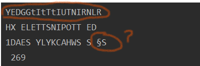
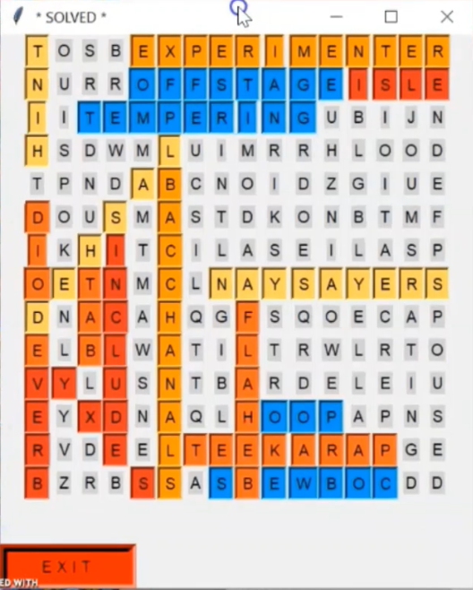

# **SEARCH WORD BOT**
 

 

##Libraries Used 

* TKINTER
* PYTESSERACT
* CV2

To see the Real Search Word WEBSITE  [Click Hear](http://word-search-puzzles.appspot.com/)
***

### About This Project
***

This Project is Divided into Two Main Parts

* #### TAKING THE INPUT

The Image Segment's Of the Interpreted Words with Wired Symbols. 

> *This is Really the Challenging Part Because We are Suppose To Get the Data From the 
>the Real World Which means we have to Deal with Complicated thing Like Convertimg the Image into
>Text ,Hence This Program First Converts The Image into grid Of Letters which many Times It happens that 
>it Captures wrong Letters and It Capture Character's like " ! , } , @ " etc, Hence Requires A lot Of Prepossessing in the Background.*

 

> We Have Collected Wordes Of the to Be Searched Using Web Scraping with Selenium

> ***NOTE*** - **One Could Think That Why Din't We Took The Grid Letters with Using 
>Scraping ? Actully That is Not Possible Because This Data is Not Made Avalable To 
>Scrapy Elements , Hence This Program First Takes The Screenshot of The Grid Then
>Converts It In to Text Grid**.
>

* #### APPLYING BOT ALGORITHM ON DATA

> *This is The Easier than the  Data Collection, Once The Data Is Collected (Data Consist)
>BOT Find's In all The Eight Direction's With the Help of Dictionary Data Structure In Python*

 

##### **OUTPUT WINDOW**

